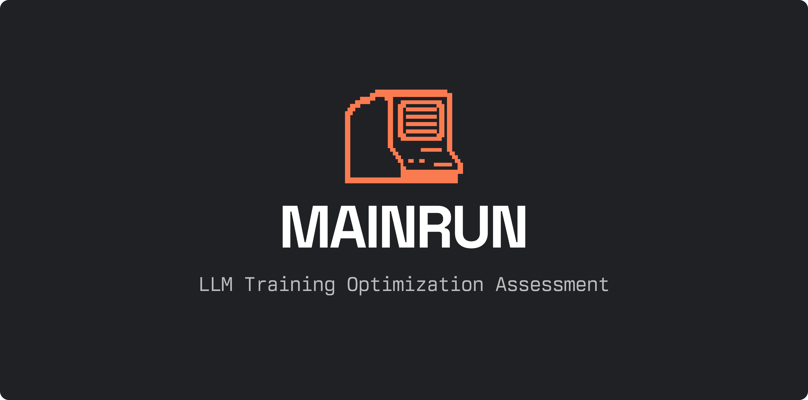

<div align="center">
  
  
  [](.devcontainer)
  [](https://www.python.org/)
  [](https://pytorch.org/)
</div>

## Why Mainrun?

Mainrun is [Maincode's](https://maincode.com) standardized assessment framework for evaluating machine learning engineering expertise, specifically focused on LLM training and optimization. This project provides a consistent, real-world environment to explore a candidate's knowledge of:

- Transformer architectures and training dynamics
- Performance optimization techniques
- Code quality and engineering practices
- Problem-solving approaches to ML challenges
- Areas of personal interest and expertise in ML optimization

## The Challenge
Your task is to analyze and improve the training run of a small GPT-2 style model. The code is designed to train on a Hacker News headline dataset.

Your goal is to minimize the validation loss as low as possible within 7 epochs. The baseline to beat is a validation loss of 1.754.

### The Rules
The rules are simple:

- You cannot change the number of epochs, the random seed, the dataset, or the validation fraction.
- You cannot change the `evaluate()` function.
- Everything else is fair game! You can change the model architecture, initialization, tokenization, hyperparameters, optimizer, scheduler, training loop, etc.

## Getting Started

```bash
# 1. Clone the repository and open it in VS Code
git clone <your-assessment-repo-url>
cd mainrun
code .

# 2. When prompted, reopen the project in the Dev Container
# This initial build may take a few minutes.

# 3. Run the baseline training to see the starting point
task train

# 4. Analyze the baseline performance in the log file
cat mainrun/logs/baseline.log

# 5. Start optimizing!
```

## Key Commands
You will only need two main commands for this assessment:

- `task train`: The primary command. It first runs a checkpoint and then executes the full training pipeline in train.py. You have complete freedom to refactor or extend the code, but all functionality must be accessible through this single script.
- `task submit`: When you are ready, this command will create a final checkpoint, zip up your entire repository (including all code and logs), and upload it to Maincode's evaluation system for review.

## Evaluation
Submissions will be evaluated on:

1. **Model Performance**: Most importantly, the improvement in validation loss compared to the baseline.
2. **Code Quality**: Clean, maintainable, and well-documented code.
3. **Innovation**: Creative or insightful approaches to optimization.
4. **Documentation**: A short report.pdf that walks through the changes you made, your reasoning, and their effect on the training curves.

## Legal and Contributing
By participating and submitting your work, you agree to the terms outlined in our [Legal Notice](LEGAL-NOTICE.md). This includes the assignment of all intellectual property rights in your submission to Maincode Pty Ltd.

For information on how to report issues or suggest improvements to the assessment framework itself, please see our [Contributing Guide](CONTRIBUTING.md).

## The Team

This project is made possible by these wonderful contributors:

| Name          | GitHub Profile                                |
|---------------|----------------------------------------------|
| **Kees** | [@casebakker](https://github.com/casebakker)      |
| **Sara**| [@maincode-sarae](https://github.com/maincode-sarae)|
| **Fabian** | [@fabian-maincode](https://github.com/fabian-maincode)|
| **Dave** | [@maincode-dave](https://github.com/maincode-dave) |